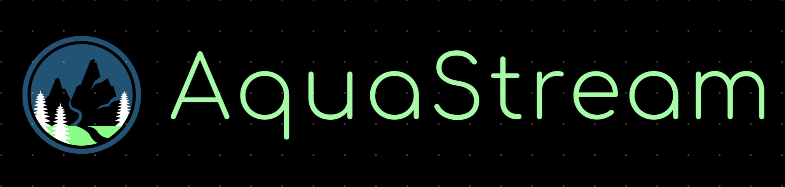

# Welcome to AquaStream

## About Us
We are a group of four dedicated individuals united by our passion for environmental sustainability and data science. Our team, known as **WeDon’tHallucinate**, is excited to work on the WaterLevels Oker project, which focuses on predicting the water levels of the German river Oker. By leveraging advanced data analysis and machine learning techniques, we aim to provide accurate and timely water level forecasts. These predictions are vital for flood management and environmental protection.

At AquaStream, we believe in the power of data to drive meaningful change. Our mission is to create reliable tools that can assist various stakeholders in making informed decisions to protect and manage water resources effectively.

---

## Our Idea
We are working on predicting the water levels of the Oker River using weather climate data and sensor-measured water levels to generate an AI model that can predict water levels accurately and warn about flooding and other parameters. We will employ supervised learning techniques to predict water levels based on climate characteristics. The final goal will be to develop a web app/mobile app that can be used independently and extensively by the administration of Braunschweig city to effectively monitor and prevent any mishaps or adverse flooding effects.

---

## Team Members

[**Tim Hildebrandt**](mailto:tim.hildebrandt@me.com)

Tim is a data scientist with a strong commitment to ethical technology development. Before completing a bootcamp in Data Science and Machine Learning, he worked as a researcher at the Technical University in Berlin, leading projects on fair mobility and responsible AI.

[**Vishwa Hatwalne**](mailto:direct2vishwa@gmail.com)

Vishwa is a Master of Science in Data Science student at Technische Universität Braunschweig. With a robust background in machine learning and data science, he has hands-on experience in object detection, continual learning algorithms, and MLOps pipelines. His technical expertise includes proficiency in Python, C++, Java, SQL, and experience with PyTorch and TensorFlow. He has successfully contributed to projects at DHL IT Services, enhancing business processes with customized machine learning models and efficient data solutions.

[**Oussama Turki**](mailto:o.turki036@gmail.com)

Oussama is an Aerospace Engineer who graduated from TU Braunschweig. He has a background in AI (Machine Learning and Deep Learning) and is also interested in Quantum Computing. He has worked in Embedded Systems using C and C++. His Bachelor's thesis was about detecting the horizon line for autopilot airplanes using various models in Machine Learning and Deep Learning.

[**Akarshan Kapoor**](mailto:data.akarshan@icloud.com)

Akarshan is an exchange student at TU Braunschweig in the Informatik Department and a data science and engineering student at IIT Mandi. He has worked as a Software and Firmware Intern at BestSensor.de, and is a Google Summer of Code Contributor to OpenPrinting (2023 & 2024) under the Linux Foundation. He is also a Research Assistant at the Institute of Aircraft Design and Lightweight Structures (IFL), a former Coordinator of the Programming Club at IIT Mandi, and a Machine Learning Enthusiast specializing in Natural Language Processing. He is skilled in Unity Game Engine Development and passionate about leveraging a diverse skill set to drive technological innovation.

---

    We are excited to embark on this journey and collaborate with like-minded individuals and organizations in the near future. Join us as we explore innovative solutions to predict water levels and contribute to a sustainable future.

